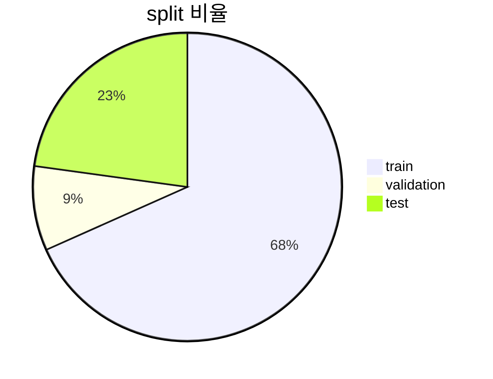
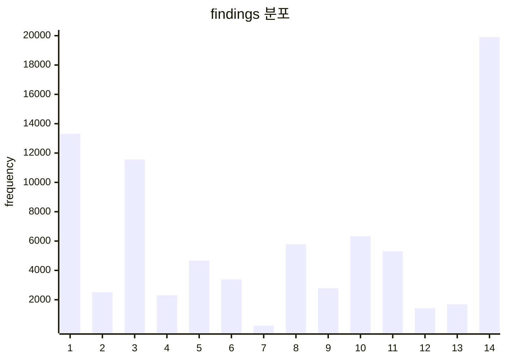

# Project

## 0. Build Environment

ubuntu 20.04 기준입니다.

```bash
    apt-get install  mysql-server mysql-client  libmysqlclient-dev build-essential
    echo 'export PATH="/usr/local/opt/mysql-client/bin:$PATH"' >> ~/.zshrc # zsh 사용해서 이렇게 함
    export MYSQLCLIENT_CFLAGS=$(mysql_config --cflags)
    export MYSQLCLIENT_LDFLAGS=$(mysql_config --libs)
    pip install mysqlclient  
    python3 ./locallibrary/manage.py runserver 
```

## 1. Dataset EDA 

데이터셋은 NIH Chest X-ray 14 dataset를 활용하며, 학습에 앞서 데이터 EDA 진행.


### 1.1 split 비율


- 총 112,120개의 데이터 중 학습 데이터 76,599개, 검증 데이터 9,925개, 평가 데이터 25,596개로 분할하였음.


### 1.2 findings 분포


 **- x축 병명** <br>
1 : Effusion
2 : Emphysema 
3 : Atelectasis 
4 : Edema <br>
5 : Consolidation 
6 : Pleural Thickening 
7 : Hernia 
8 : Mass <br>
9 : Cardiomegaly 
10 : Nodule 
11 : Pneumothorax 
12 : Pneumonia <br>
13 : Fibrosis 
14 : Infiltration


### 1.3 데이터 스플릿 별 나이 분포

| split | mean  |  std  |  max  |  min  |
| :---: | :---: | :---: | :---: | :---: |
| total | 46.63 | 16.60 |  95   |   0   |
| train | 46.63 | 16.63 |  95   |   0   |
| valid | 46.36 | 16.98 |  93   |   0   |
| test  | 46.72 | 16.37 |  92   |   0   |


### 1.4 데이터 스플릿 별 성별 분포 
| split | female |  male  |
| :---: | :----: | :----: |
| total | 48,780 | 63,340 |
| train | 33,287 | 43,312 |
| valid | 4,779  | 5,146  |
| test  | 10,714 | 14,882 |


### 1.5 데이터 스플릿 별 촬영 자세 분포
- PA : 선 채로 검사(일반적)
- AP : 누운 채로 검사(거동이 불편하거나 의식이 없는 경우)

| split |   PA   |   AP   |
| :---: | :----: | :----: |
| total | 67,310 | 44,810 |
| train | 49,811 | 26,788 |
| valid | 6,403  | 3,522  |
| test  | 14,500 | 11,096 |


### 1.6 촬영 자세 별 나이 분포

|  split   | mean  |  std  |  max  |  min  |
| :------: | :---: | :---: | :---: | :---: |
| total.AP | 45.85 | 17.18 |  94   |   0   |
| total.PA | 47.14 | 16.18 |  95   |   0   |
| train.AP | 45.87 | 17.24 |  94   |   0   |
| train.PA | 47.04 | 16.28 |  95   |   0   |
| valid.AP | 44.52 | 18.11 |  86   |   0   |
| valid.PA | 47.37 | 16.23 |  93   |   1   |
| test.AP  | 46.13 | 16.83 |  86   |   0   |
| test.PA  | 47.49 | 15.72 |  92   |   2   |


### 1.7 Findings 별 평균 나이 및 촬영 자세, 성별 비율

|      findings      |  age(세)  |   AP(%)   | PA(%) | 여성(%) | 남성(%) |
| :----------------: | :-------: | :-------: | :---: | :-----: | :-----: |
|       Normal       |   45.48   |   34.89   | 65.11 |  43.80  |  56.20  |
|      Effusion      |   49.52   |   50.52   | 49.48 |  44.17  |  55.83  |
|     Emphysema      |   50.08   |   40.42   | 59.58 |  36.01  |  63.99  |
|    Atelectasis     | **50.25** |   50.45   | 49.55 |  40.25  |  59.75  |
|       Edema        |   45.11   | **88.02** | 11.98 |  47.72  |  52.28  |
|   Consolidation    |   46.38   |   67.41   | 32.59 |  42.88  |  57.12  |
| Pleural Thickening |   50.24   |   28.57   | 71.43 |  39.68  |  60.32  |
|       Hernia       | **63.01** |   15.42   | 84.58 |  57.71  |  42.29  |
|        Mass        |   48.48   |   38.31   | 61.69 |  38.97  |  61.03  |
|    Cardiomegaly    |   47.01   |   43.70   | 56.30 |  52.92  |  47.08  |
|       Nodule       |   49.25   |   34.02   | 65.98 |  41.79  |  58.21  |
|    Pneumothorax    |   46.26   |   35.74   | 64.26 |  48.76  |  51.24  |
|     Pneumonia      |   44.41   |   55.97   | 44.03 |  41.44  |  58.56  |
|      Fibrosis      | **52.48** |   16.49   | 83.51 |  45.73  |  54.27  |
|    Infiltration    |   45.96   |   52.99   | 47.01 |  42.56  |  57.44  |

**observation**
 - Hernia 일 때, 63.01세의 가장 높은 평균 연령을 가짐. 
 - Edema 일 때, 대부분 AP 방식으로 촬영함.
 - Hernia, Fibrosis 일 때, 대부분 PA 방식으로 촬영함.
 -  Hernia, Cardiomegaly 일 때, 여성의 비율이 남자보다 높음.


### 1.8 Findings 별 함께 검출되는 병변(Top 3)

|      findings      |        Top 1        |        Top 2        |        Top 3         |
| :----------------: | :-----------------: | :-----------------: | :------------------: |
|      Effusion      | Infiltration(4,000) | Atelectasis(3,275)  | Consolidation(1,287) |
|     Emphysema      |  Pneumothorax(747)  |  Infiltration(449)  |   Atelectasis(424)   |
|    Atelectasis     |   Effusion(3,275)   | Infiltration(3,264) | Consolidation(1223)  |
|       Edema        |  Infiltration(981)  |    Effusion(593)    |    Pneumonia(340)    |
|   Consolidation    |   Effusion(1,287)   | Atelectasis(1,221)  | Infiltration(1,221)  |
| Pleural Thickening |    Effusion(849)    |  Infiltration(750)  |   Atelectasis(496)   |
|       Hernia       |   Atelectasis(40)   |  Infiltration(33)   |       Mass(25)       |
|        Mass        |   Effusion(1,254)   | Infiltration(1,159) |     Nodule(906)      |
|    Cardiomegaly    |   Effusion(1,063)   |  Infiltration(587)  |   Atelectasis(370)   |
|       Nodule       | Infiltration(1,546) |    Effusion(912)    |      Mass(906)       |
|    Pneumothorax    |    Effusion(996)    |  Infiltration(946)  |   Atelectasis(774)   |
|     Pneumonia      |  Infiltration(605)  |     Edema(340)      |    Effusion(269)     |
|      Fibrosis      |  Infiltration(345)  |  Atelectasis(220)   |    Effusion(188)     |
|    Infiltration    |   Effusion(4,000)   | Atelectasis(3,264)  |    Nodule(1,546)     |

**Observation**
- 병변 검출 시, 함께 검출되는 병변으로 'Infiltration', 'Effusion', 'Atelectasis'가 많음. 따라서 이 병들은 발병률이 높거나 다른 병변의 생김새와 헷갈릴 가능성이 있음.

### AU ROC 성능 스코어
| findings(threshold) | threshold | auroc  | torchxrv | sensitivity | specificity |
| :-----------------: | :-------: | :----: | :------: | :---------: | :---------: |
|      Effusion       |   0.40    | 0.8076 |   0.85   |   0.7213    |   0.7488    |
|      Emphysema      |   0.15    | 0.8954 |   0.73   |   0.7951    |   0.8475    |
|     Atelectasis     |   0.30    | 0.7258 |   0.76   |   0.6700    |   0.6592    |
|        Edema        |   0.30    | 0.8237 |   0.85   |   0.7524    |   0.7535    |
| Pleural-Thickening  |   0.25    | 0.7330 |   0.74   |   0.6675    |   0.6879    |
|    Cardiomegaly     |   0.15    | 0.8616 |   0.88   |   0.7717    |   0.7764    |
|    Pneumothorax     |   0.45    | 0.8367 |   0.75   |   0.7741    |   0.7503    |
|      Fibrosis       |   0.15    | 0.7390 |   0.72   |   0.6873    |   0.6612    |

