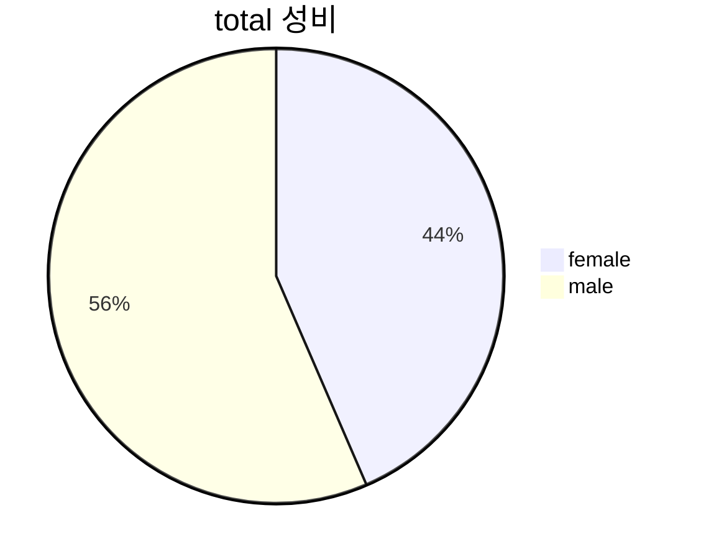
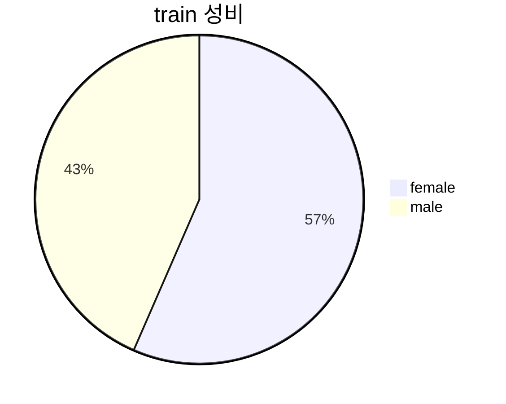
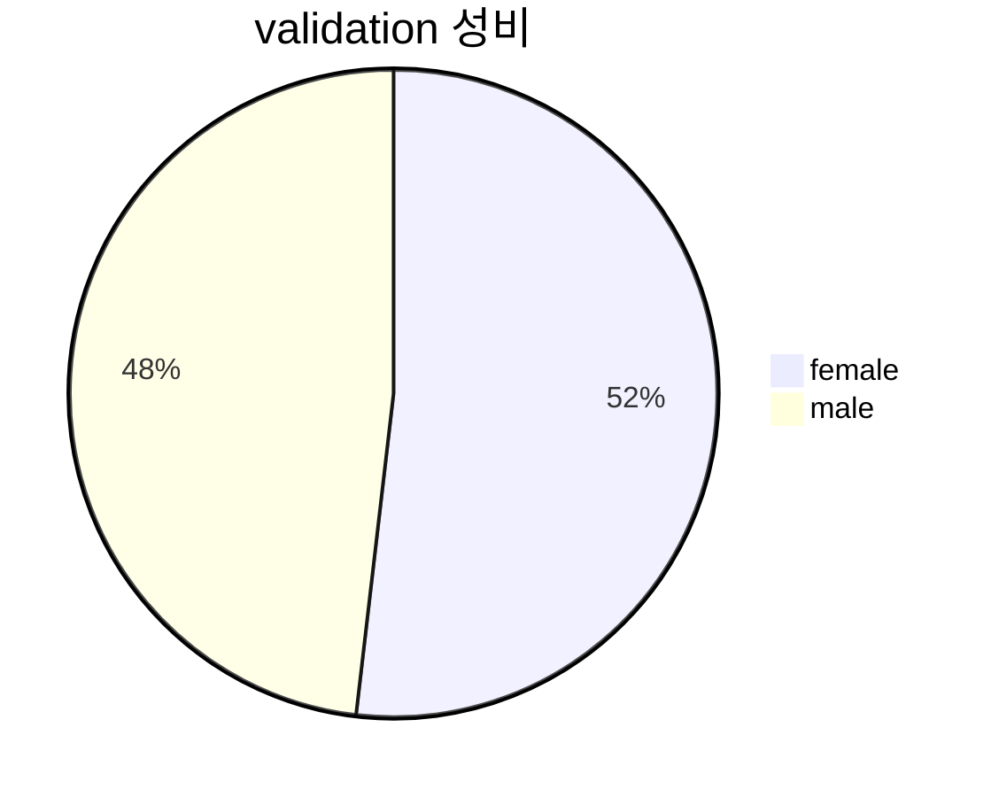

# Project

## 1. Dataset EDA 

데이터셋은 NIH Chest X-ray 14 dataset를 활용하며, 학습에 앞서 데이터 EDA 진행.


### 1.1 데이터 스플릿 별 나이 분포

| split | mean  |  std  |  max  |  min  |
| :---: | :---: | :---: | :---: | :---: |
| total | 46.63 | 16.60 |  95   |   0   |
| train | 46.63 | 16.63 |  95   |   0   |
| valid | 46.36 | 16.98 |  93   |   0   |
| test  | 46.72 | 16.37 |  92   |   0   |


### 1.2 데이터 스플릿 별 성별 분포 
| split | female |  male  |
| :---: | :----: | :----: |
| total | 48,780 | 63,340 |
| train | 43,312 | 33,287 |
| valid | 5,146  | 4,779  |
| test  | 14,882 | 10,714 |

<!-- 



```mermaid
pie title test 성비
    "female" : 14882
    "male" : 10714
``` -->